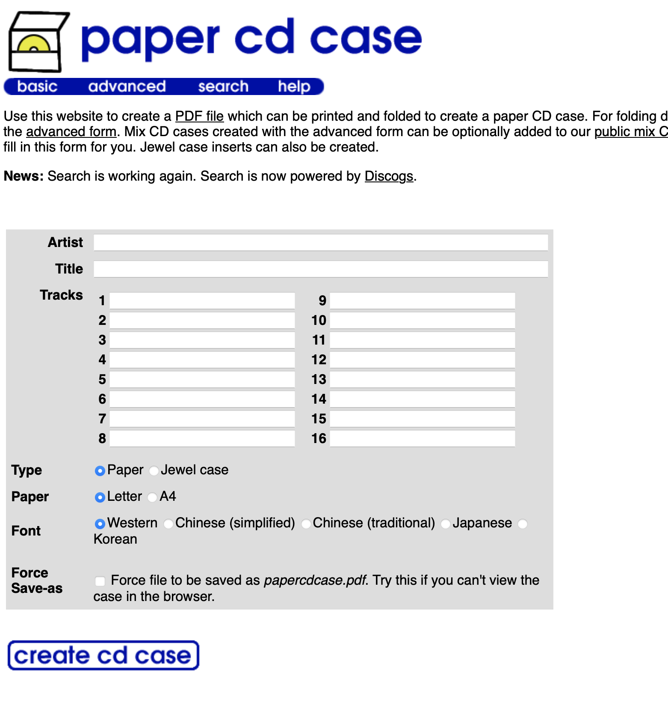

# ST-6 Тестирование web-приложений с использованием фрейморка Selenium (1)


Срок выполнения задания:

**по 30.05.24** 

## Подготовка к выполнению работы

- установить браузер Google Chrome последних версий
- скачать со страницы [Chrome for Testing availability](https://googlechromelabs.github.io/chrome-for-testing/) версию драйвера, соответствующую установленной версии браузера
- для браузера Google Chrome скачать расширение **xpath**


## Задание №1

В среде **Intellij Idea** создать проект **Maven** по шаблону **quickstart**. Убедиться в появлении веток `java/main` и `java/test` в разделе `src` проекта, а также файла с конфигурацией `pom.xml` в корне проекта.

В **pom.xml** поместить зависимость **Selenium-Java**:

```xml
    <dependency>
      <groupId>org.seleniumhq.selenium</groupId>
      <artifactId>selenium-java</artifactId>
      <version>4.15.0</version>
    </dependency>

```

В файл **App.java** поместить код для проверки работы Selenium

```java
        System.setProperty("webdriver.chrome.driver", "путь к драйверу в файловой системе");
        WebDriver webDriver = new ChromeDriver();
        try {
            webDriver.get("https://www.calculator.net/password-generator.html");
        } catch (Exception e) {
            System.out.println("Error");
            System.out.println(e.toString());
        }
```
Построить и запустить проект. В результате должно автоматически открыться окно браузера и в него загрузится страница, чей URL указан в коде программы.

## Задание №2

Открыть в отдельной сессии браузера Chrome страницу по адресу 
Содержимое страницы должно выгледеть примерно так:




